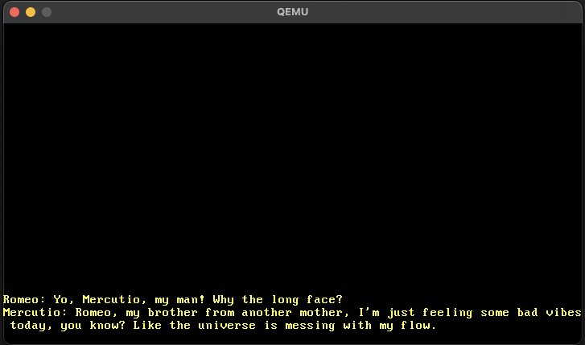

# sysculptors

An OS in Rust, how hard can it be?

Learning a bunch of Rust and Operating Systems following https://os.phil-opp.com/ blog.

## Getting Started

Clone the repo.

## Dependencies

Install bootimage

```
cargo install bootimage
```

make sure you have:

1. the nightly version of rust can be installed by running

```
rustup toolchain install nightly
```

2. rust-src

```
rustup component add rust-src
```

3. llvm-tools-preview

```
 rustup component add llvm-tools-preview
```

4. qemu

```
brew install qemu
```

## Run

Build and run

```
cargo run
```


